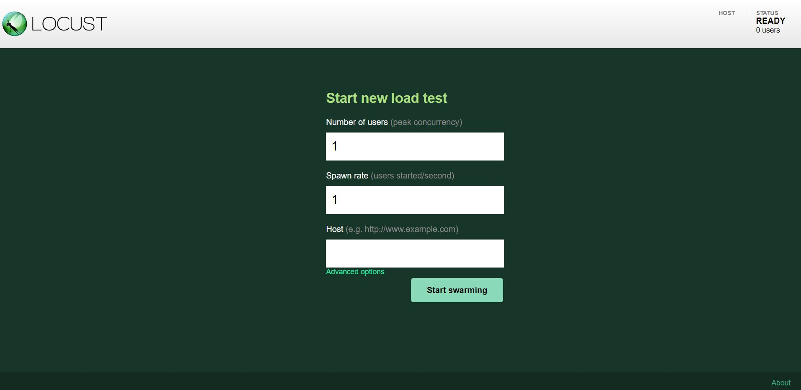
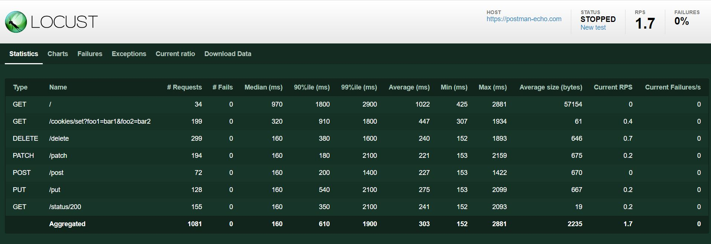
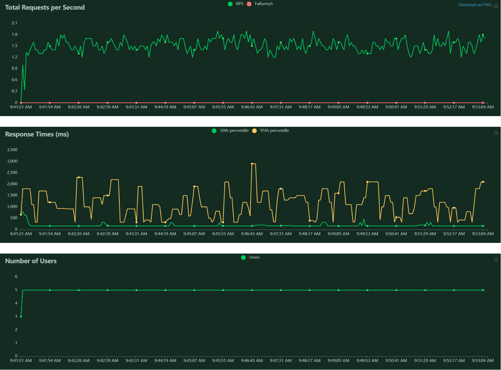
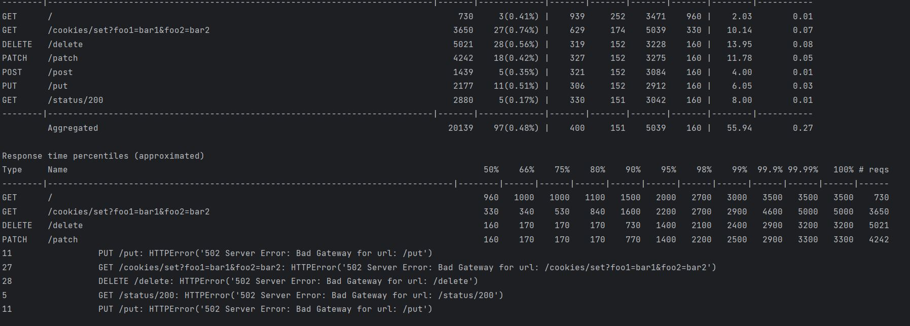

# An example of using Locust and Python for load testing.  
<br>

* Locust - https://locust.io/

## Running tests

Local Launch:
```
locust -f locustfile.py
```

If you need to specify the Number of users and Spawn rate and Host at once, you need to specify the command:
```
locust -f locustfile.py --host=http://example.com --users 100 --spawn-rate 10
```
<br>

## Main page where you need to specify data (Number of users and Spawn rate and Host)
<p>

</p>
<br>


## An example of displaying a statistics page with test results
<p>

</p>
<br>


## An example of displaying a page with charts showing the total number of requests per second, response time, and number of users
<p>

</p>
<br>


## Test results displayed in the console after stopping the tests
<p>

</p>
<br>